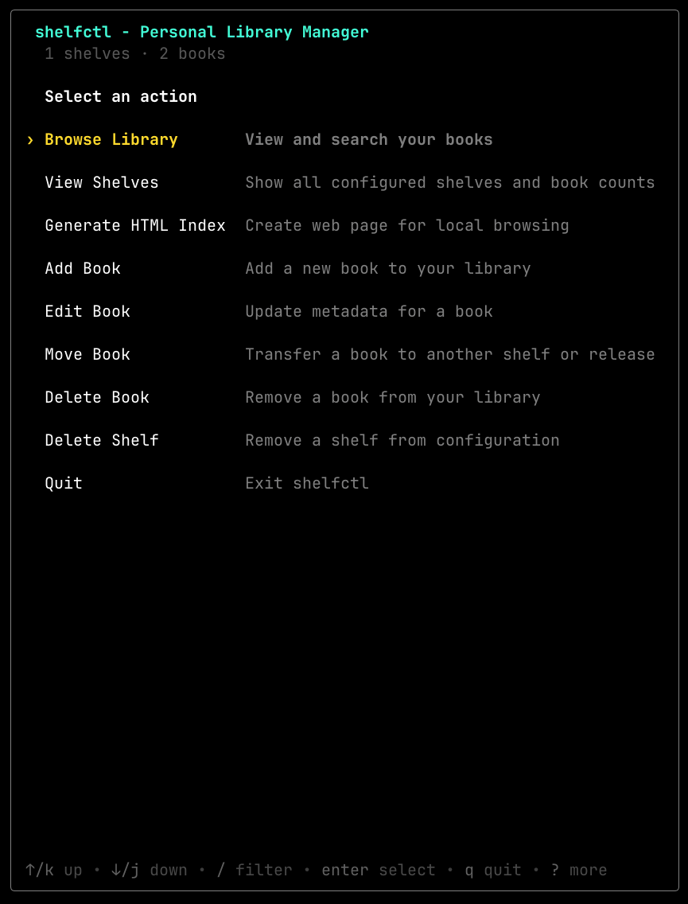
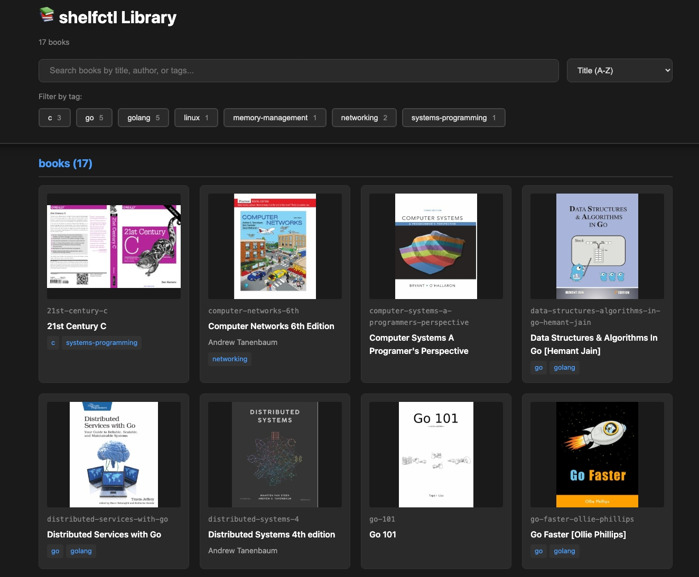

# shelfctl

[](https://github.com/blackwell-systems)
[](https://github.com/blackwell-systems/shelfctl/actions/workflows/ci.yml)
[](https://goreportcard.com/report/github.com/blackwell-systems/shelfctl)
[](https://opensource.org/licenses/MIT)
[](https://buymeacoffee.com/blackwellsystems)

<p align="center">
  
</p>

<p align="center">
  <em>Meet Shelby, your friendly library assistant.</em>
</p>

<p align="center">
  
</p>

**Organize the PDFs and books you already have scattered across GitHub.**

If you use GitHub, you've probably hit this: one monolithic "books" repo with hundreds of PDFs, or files scattered across random repos and gists. Eventually you hit GitHub's 100MB limit, or you bolt on Git LFS and discover it's expensive and annoying for a personal library.

Once PDFs land in git history, every clone stays heavy forever. Even after you delete the files, git history never forgets.

shelfctl solves this by storing files as GitHub Release assets (not git commits) and keeping only metadata in a simple `catalog.yml`. That means you can split a bloated repo into topic-based shelves, migrate books out of existing repos, and search + download on demand (without moving your library to a new service).

> [!WARNING]
> Deleting a PDF from a git repo doesn't remove it from git history. Clones still carry the weight. shelfctl avoids this entirely by storing documents as Release assets (only metadata is versioned).

Your GitHub account already gives you reliable distribution and storage primitives. shelfctl turns them into a library:
- Release assets for the PDFs/EPUBs
- `catalog.yml` for searchable metadata
- one repo per shelf (`shelf-programming`, `shelf-history`, …)
- Migration tools to split bloated repos and reorganize existing collections

> [!TIP]
> **Already have PDFs committed in git?** shelfctl can scan and migrate them into shelves without manual re-uploads:
> ```bash
> shelfctl migrate scan --source you/old-books-repo > queue.txt
> ```

**Three ways to browse your library:**
- **Interactive TUI** - visual browser with keyboard navigation and search
- **Static HTML index** - web-based viewer with tag filters and search (works offline)
- **Scriptable CLI** - pipe, filter, automate, and integrate with shell workflows

Your library stays portable, backed by normal git repos. Free by default (only pay if you choose Git LFS or exceed GitHub plan limits).

---

## Why not commit PDFs?

**The tradeoff:**

| Approach | Git History | Clone Weight | Per-File Download | Cost |
|----------|-------------|--------------|-------------------|------|
| **Git commit** | Bloats forever | Heavy (even after deleting files) | Possible, but awkward | Free |
| **Git LFS** | Clean | Still heavier than needed | Possible, but awkward | Paid storage/bandwidth |
| **Release asset** | Clean | Light | Yes (native) | Free* |

*Free by default. You only pay if you choose LFS or exceed GitHub plan limits.

**Why Release assets:**
- Git history stays clean (only metadata is versioned)
- Documents live outside version control entirely
- Download individual files on-demand from GitHub's CDN

### On-demand downloads (no cloning)
Fetch a single book without cloning a repo or pulling a whole archive.
`shelfctl open <book-id>` downloads *only that file* from GitHub's CDN and opens it. Your library can be huge, but you only download what you actually read.

---

<p align="center">
  
</p>

## Features

### Release assets backend (no git history bloat)
Files are stored as GitHub Release assets, not git commits. Your repository stays lightweight and git history never bloats.

### On-demand open (per-file download)
Download and open a single book without cloning the entire repository. Your library can be huge, but you only fetch what you need.

### Migration tools: scan → split → migrate
Built-in tools to scan existing repos, reorganize into topic-based shelves, and migrate files automatically. No manual re-uploads required.

### Static HTML index
Generate a web-based library viewer with cover thumbnails, tag filters, and live search. Works offline in any browser without running shelfctl.

### TUI + CLI
Interactive visual browser with keyboard navigation, or scriptable command-line interface for automation and shell workflows.

---

## How it works

- **One repo per topic shelf**
  Create shelf repos like `shelf-programming`, `shelf-history`, etc.

- **Books live in Releases, not git history**
  PDFs/EPUBs are uploaded as **GitHub Release assets** (not committed to the repo).

- **`catalog.yml` is the source of truth**
  Each shelf repo contains a `catalog.yml` that stores searchable metadata and maps book IDs to release assets. Only metadata is versioned; the actual documents live outside git history.

- **On-demand, per-book downloads**
  `shelfctl open <book-id>` downloads *only that one file* from GitHub's CDN and opens it.

- **Full lifecycle management**
  shelfctl supports the workflow end-to-end: **add**, **get**, **open**, **migrate**, **split**, and more.

---

## Prerequisites

- GitHub account with a personal access token
- Go 1.21+ (only if using `go install` or building from source)

<p align="center">
  
</p>

## Install

**Homebrew (macOS/Linux):**

```bash
brew install blackwell-systems/tap/shelfctl
```

**Download pre-built binary:**

Download the appropriate binary for your platform from the [releases page](https://github.com/blackwell-systems/shelfctl/releases/latest), extract the archive, and run:

```bash
tar -xzf shelfctl_*_Darwin_arm64.tar.gz  # or your platform
./shelfctl
```

Optionally move to your PATH: `mv shelfctl /usr/local/bin/`

**Using Go:**

```bash
go install github.com/blackwell-systems/shelfctl/cmd/shelfctl@latest
```

This downloads the module at the latest version, builds shelfctl, and places it in `$(go env GOPATH)/bin` (or `$GOBIN` if set).

**Build from source:**

```bash
git clone https://github.com/blackwell-systems/shelfctl
cd shelfctl
make build
```

## Authentication

shelfctl authenticates using a GitHub personal access token (PAT). Set `GITHUB_TOKEN` in your environment.

**Classic PAT scopes:**
- `repo` - for private shelves
- `public_repo` - for public-only shelves

**Fine-grained PAT permissions:**
Grant **Contents** (Read/Write) and **Releases** (Read/Write) on the shelf repos you manage.

**Note**: GitHub CLI (`gh`) is not required - shelfctl uses the GitHub REST API directly.

### Setup Options

**Option A: Using gh CLI (optional convenience)**

If you already have [GitHub CLI](https://cli.github.com/) installed and authenticated:

```bash
gh auth login
export GITHUB_TOKEN=$(gh auth token)
```

**Option B: Manual token**

1. Visit https://github.com/settings/tokens
2. Generate new token (classic or fine-grained)
3. Select required scopes/permissions (see above)
4. Copy the token (starts with `ghp_` or `github_pat_`)

```bash
export GITHUB_TOKEN=ghp_your_token_here
```

Add to shell profile to persist (`~/.bashrc` or `~/.zshrc`).

**API Rate Limits**: GitHub's authenticated API allows 5,000 requests/hour. shelfctl caches downloaded book files locally; metadata is fetched from GitHub as needed. For typical personal library usage, you're unlikely to hit rate limits.

<details>
<summary><strong>Optional: PDF Cover Thumbnails</strong></summary>

For automatic cover extraction from PDFs, install poppler:

```bash
# macOS
brew install poppler

# Ubuntu/Debian
sudo apt-get install poppler-utils

# Fedora/RHEL
sudo dnf install poppler-utils

# Arch Linux
sudo pacman -S poppler
```

Not required - shelfctl works fine without it. Covers are extracted automatically when you download PDFs if poppler is installed.

</details>

---

## Quick start

**Note**: Complete the [Prerequisites](#prerequisites), [Install](#install), and [Authentication](#authentication) sections first.

### Interactive Mode (Easiest)

Run `shelfctl` with no arguments to launch an interactive menu:

```bash
shelfctl
```

<p align="center">
  
</p>

This provides a visual interface with:
- 🎯 **Guided workflows** - No need to remember commands or flags
- 📚 **Browse Library** - Visual book browser with search
- ➕ **Add Book** - File picker + metadata form
- 📊 **Status dashboard** - See shelf and book counts at a glance

See [docs/HUB.md](docs/HUB.md) for full details.

### Command-Line Mode

**Already have PDFs in GitHub repos?** Organize them:

```bash
# (Ensure GITHUB_TOKEN is set - see Authentication section above)

# Scan your existing repos for files
shelfctl migrate scan --source you/old-books-repo > queue.txt

# Create organized shelves (private by default)
shelfctl init --repo shelf-programming --name programming --create-repo --create-release
shelfctl init --repo shelf-research --name research --create-repo --create-release

# Or make a shelf public
shelfctl init --repo shelf-public --name public --create-repo --create-release --private=false

# Edit queue.txt to map files to shelves, then migrate
shelfctl migrate batch queue.txt --n 10 --continue
```

**Starting fresh?** Add books directly:

```bash
# Add a book
shelfctl shelve ~/Downloads/sicp.pdf --shelf programming --title "SICP" --author "Abelson & Sussman" --tags lisp,cs

# List books across all shelves
shelfctl browse --shelf programming

# Open a book - downloads just this one file (6MB), not the entire release
shelfctl open sicp

# On another machine? Same command fetches it on-demand from GitHub
shelfctl open sicp

# Generate static HTML index for web browsing
shelfctl index
open ~/.local/share/shelfctl/cache/index.html  # Opens in default browser
```

<p align="center">
  
</p>

---

<p align="center">
  
</p>

## Commands

| Command | Description |
|---------|-------------|
| `init` | Bootstrap a shelf repo and release |
| `shelves` | Validate all configured shelves |
| `delete-shelf` | Remove a shelf from configuration |
| `browse` | Browse your library (interactive TUI or text) |
| `index` | Generate local HTML index for web browsing |
| `verify` | Detect catalog vs release mismatches, auto-fix with `--fix` |
| `cache clear` | Remove books from local cache without deleting from shelves |
| `cache info` | Show cache statistics and disk usage |
| `info <id>` | Show metadata and cache status |
| `open <id>` | Open a book (auto-downloads if needed) |
| `shelve <file\|url>` | Add a book to your library |
| `edit-book [id]` | Update metadata for one or multiple books (batch mode) |
| `delete-book <id>` | Remove a book from your library |
| `move <id>` | Move between releases or shelves |
| `split` | Interactive wizard to split a shelf |
| `migrate one` | Migrate a single file from an old repo |
| `migrate batch` | Migrate a queue of files |
| `migrate scan` | List files in a source repo |
| `import` | Import all books from another shelf |
| `completion` | Generate shell autocompletion scripts |

---

## Configuration

Default config path: `~/.config/shelfctl/config.yml`

```yaml
github:
  owner: "you"
  token_env: "GITHUB_TOKEN"  # Environment variable to read token from

defaults:
  release: "library"

shelves:
  - name: "programming"
    repo: "shelf-programming"
  - name: "history"
    repo: "shelf-history"
```

**Security**: The token itself is never stored in the config file - only the environment variable name. shelfctl reads the token from your environment at runtime.

See [`config.example.yml`](config.example.yml) for a complete example.

---

<p align="center">
  
</p>

## Documentation

- **[Tutorial](docs/TUTORIAL.md)** - Step-by-step walkthrough from installation to advanced workflows
- **[Architecture Guide](docs/ARCHITECTURE.md)** - How shelves work, organization strategies, schemas, and configuration
- **[Interactive Hub](docs/HUB.md)** - Guide to the interactive TUI menu
- **[Commands Reference](docs/COMMANDS.md)** - Complete documentation for all commands
- **[Troubleshooting](docs/TROUBLESHOOTING.md)** - Common issues and solutions
- **[Contributing](CONTRIBUTING.md)** - Development guidelines

---

## Design Philosophy

shelfctl is domain-specific by design: it solves the PDF/EPUB library problem and nothing else. This narrow focus keeps it simple, maintainable, and excellent at what it does.

---

## ⚖️ Disclaimer

shelfctl is a specialized management tool designed to help developers organize their personal document libraries using the GitHub API. By using this software, you agree to the following:

**Platform Compliance**: You are solely responsible for ensuring that your use of GitHub as a storage backend complies with GitHub's Terms of Service and Acceptable Use Policies. The author(s) of shelfctl are not responsible for any account suspensions or data removal by GitHub.

**Content Responsibility**: shelfctl does not provide, host, or distribute any content. Users are responsible for ensuring they have the legal right to store and distribute any files they upload to their own GitHub repositories and releases.

---

## Support This Project

<p align="center">
  <a href="https://github.com/blackwell-systems/shelfctl">
    
  </a>
</p>

If you find shelfctl useful:
- ⭐ **Star the repo** on GitHub
- 🐛 **Report issues** or suggest features
- 🤝 **Contribute** improvements (see [CONTRIBUTING.md](CONTRIBUTING.md))
- ☕ **Buy me a coffee** via the badge above

---

## Credits

Shelby the Shelf (our mascot) is a terminal wearing a bookshelf like a sweater, because why not.

---

## License

**Software:** MIT License - See [LICENSE](LICENSE) for details

**Shelby Mascot & Brand Assets:** You may redistribute unmodified brand assets with shelfctl. Brand assets are not licensed for reuse outside shelfctl. See [assets/LICENSE](assets/LICENSE) for details.

---

<p align="center">
  
</p>
