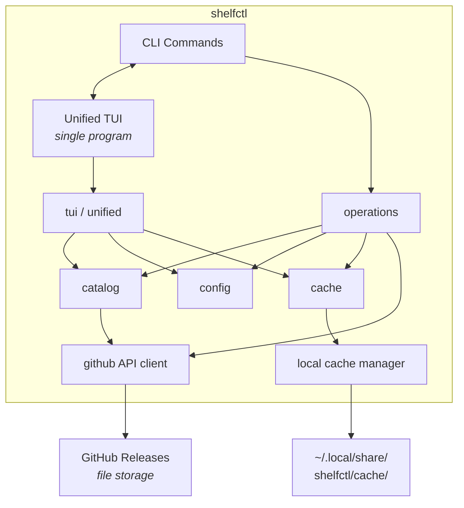
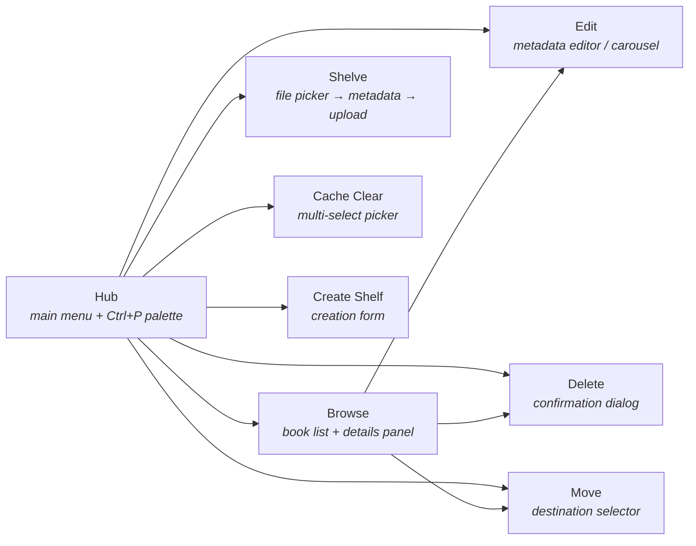
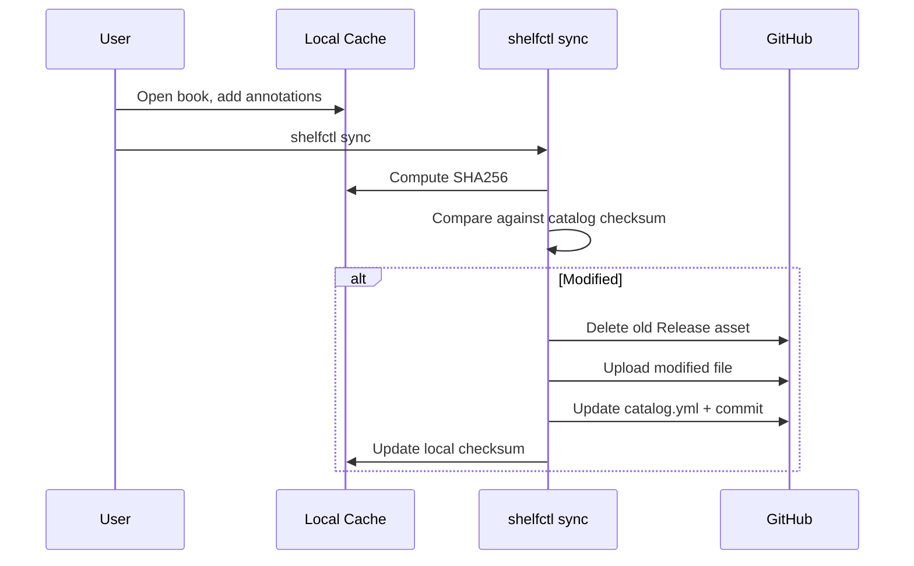
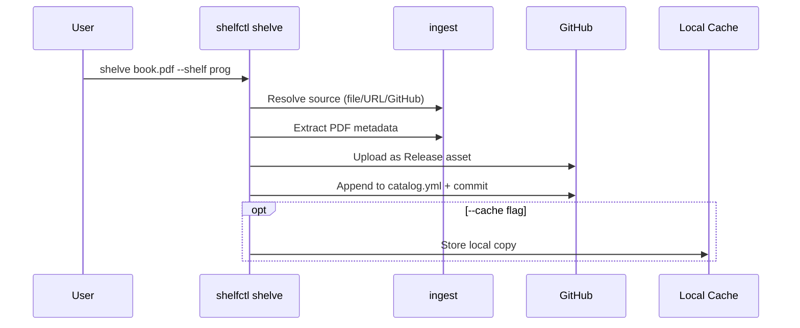

# Architecture

## System Overview

shelfctl manages PDF/EPUB libraries using GitHub as a storage backend. Files are stored as GitHub Release assets (not in git), metadata is tracked in `catalog.yml` (in git), and books are cached locally for reading and annotation sync.



### TUI Views



### Sync Flow



### Shelve Flow



## Storage Model

### Why Release Assets

GitHub Release assets store the actual book files. This avoids:
- Git history bloat (only `catalog.yml` is versioned)
- Git's 100MB per-file limit
- Git LFS costs
- Full-repo clones for single-file access

Each book is a single Release asset downloadable via GitHub CDN.

### Data Layout

```
GitHub repo (shelf-programming):
├── catalog.yml          # Metadata (git-tracked)
├── README.md            # Auto-generated inventory (git-tracked)
├── covers/              # Optional curated cover images (git-tracked)
└── releases/
    └── library/         # Release tag
        ├── sicp.pdf     # Release asset (not in git)
        ├── gopl.pdf     # Release asset (not in git)
        └── ...

Local cache (~/.local/share/shelfctl/cache/):
└── shelf-programming/
    ├── sicp.pdf         # Downloaded book
    ├── gopl.pdf
    └── .covers/
        ├── sicp.jpg           # Auto-extracted thumbnail
        └── sicp-catalog.jpg   # Downloaded catalog cover
```

### Catalog Schema

```yaml
- id: sicp
  title: "Structure and Interpretation of Computer Programs"
  author: "Abelson & Sussman"
  year: 1996
  tags: ["lisp", "cs", "textbook"]
  format: "pdf"
  checksum:
    sha256: "a1b2c3d4..."
  size_bytes: 6498234
  cover: "covers/sicp.jpg"       # Optional, git-tracked
  source:
    type: "github_release"
    owner: "your-username"
    repo: "shelf-programming"
    release: "library"
    asset: "sicp.pdf"
  meta:
    added_at: "2024-01-15T10:30:00Z"
```

Required: `id`, `title`, `format`, `source.*`
Recommended: `checksum`, `author`, `tags`, `year`, `size_bytes`
Optional: `cover`, `meta.*`

### Configuration

```yaml
# ~/.config/shelfctl/config.yml
github:
  owner: "your-username"
  token_env: "GITHUB_TOKEN"    # Reads from env var, never stores token
  api_base: "https://api.github.com"

defaults:
  release: "library"
  cache_dir: "~/.local/share/shelfctl/cache"
  asset_naming: "id"           # "id" or "original"

shelves:
  - name: "programming"       # Short name for CLI
    repo: "shelf-programming"  # GitHub repo
    owner: "other-user"        # Optional: override default owner
```

Each shelf can override the default owner for multi-user/org setups.

## Package Structure

```
internal/
├── app/           # CLI commands (cobra) and TUI launcher
├── catalog/       # Book metadata model, YAML loading, search
├── config/        # Config loading and validation
├── github/        # GitHub REST API client
├── ingest/        # PDF metadata extraction, file source resolution
├── cache/         # Local file storage, cover art, HTML index generation
├── migrate/       # Migration scanning, ledger tracking
├── operations/    # Shelf creation, README management
├── tui/           # All TUI view components
├── unified/       # TUI orchestrator, hub, view routing
└── util/          # TTY detection, formatting helpers
```

## GitHub API Client

`internal/github/` implements a focused REST client:

- **Token handling**: Bearer token from env var, stripped on S3 redirects
- **Assets**: List, find, download (streamed with progress), upload (multipart)
- **Contents**: Read/write `catalog.yml` with commit messages
- **Releases**: Get by tag, create if missing
- **Repos**: Get info, create (public/private)

Upload timeout is 5 minutes for large files. Downloads stream directly to cache.

## Commands

| Command | Description |
|---------|-------------|
| `init` | Create shelf repo, release, and config entry |
| `shelve` | Add book from local file, URL, or GitHub path |
| `open` | Download (if needed) and open with system viewer |
| `browse` | Interactive TUI browser or text listing |
| `search` | Full-text search across title, author, tags |
| `edit-book` | Update metadata (title, author, year, tags) |
| `delete-book` | Remove book, asset, and cache entry |
| `move` | Move books between releases or shelves |
| `sync` | Upload locally-modified books back to GitHub |
| `status` | Show sync status and statistics per shelf |
| `tags list` | List all tags with book counts |
| `tags rename` | Bulk rename tags across shelves |
| `split` | Interactive wizard to reorganize a shelf |
| `import` | Copy books from another shelf |
| `verify` | Detect catalog/release mismatches, `--fix` to repair |
| `shelves` | Validate all configured shelves |
| `delete-shelf` | Remove shelf (optionally delete GitHub repo) |
| `cache info` | Cache disk usage statistics |
| `cache clear` | Remove cached books (interactive or by ID) |
| `info` | Show book details and cache status |
| `index` | Generate static HTML library viewer |
| `migrate scan` | List files in source repo for migration |
| `migrate batch` | Batch-migrate with resumable ledger |
| `migrate one` | Single file migration |

## Sync Mechanism

Annotation sync detects locally-modified books and re-uploads them:

1. User opens book, adds annotations in PDF reader
2. Modified file saved to local cache
3. `shelfctl sync` compares local SHA256 against catalog checksum
4. Deletes old Release asset, uploads modified file
5. Updates catalog with new checksum
6. Single commit: "sync: update X books with local changes"

Modified files in cache are protected — `cache clear` won't delete them without `--force`.

## Cover Art

Two types, with display priority: catalog > extracted > none.

**Catalog covers** (user-curated): specified in `catalog.yml` `cover` field, stored in git, downloaded to `.covers/<id>-catalog.jpg`. Portable across machines.

**Auto-extracted thumbnails**: extracted from PDF first page via `pdftoppm` (poppler-utils) during download. Stored in `.covers/<id>.jpg`. Local-only, regenerated per machine. Parameters: JPEG, 300px max, quality 85.

## Terminal Image Rendering

`internal/tui/image.go` auto-detects terminal image protocol:

| Protocol | Terminals | Method |
|----------|-----------|--------|
| Kitty Graphics | Kitty, Ghostty | `\x1b_Ga=T,f=100,t=f;<base64>\x1b\\` |
| iTerm2 Inline | iTerm2 | `\x1b]1337;File=inline=1;width=30px:<base64>\x07` |
| None | Others | Text-only fallback |

Detection result is cached with `sync.Once` to avoid per-frame overhead.

## PDF Metadata Extraction

`internal/ingest/pdfmeta.go` extracts title/author from PDF Info dictionaries. Pure Go, no external dependencies. Scans first 8KB + last 8KB for metadata. Handles parentheses and UTF-16BE hex formats. Used to pre-populate metadata forms during shelving.

## File Source Resolution

`internal/ingest/` resolves three input types:

- **Local file**: direct filesystem read
- **HTTP URL**: streamed download
- **GitHub path**: `github:user/repo@ref:path/file.pdf` via Contents API

## Migration System

For importing from existing repos with hundreds of files:

1. `migrate scan --source owner/repo` lists all files → `queue.txt`
2. User edits queue with shelf assignments and metadata
3. `migrate batch queue.txt --n 20 --continue` processes in chunks
4. `.shelfctl-ledger.txt` tracks completed/failed entries for resumability

## HTML Index Generation

`shelfctl index` generates a self-contained `index.html` with:
- Visual grid layout with cover thumbnails
- Real-time client-side search (title, author, tags)
- Clickable tag cloud with counts
- Sort by date added, title, author, year
- `file://` links to open cached books locally
- Works completely offline

## Caching and Performance

### Parallel Operations

- **Catalog loading**: Per-shelf goroutines with pre-allocated result slices
- **Status checks**: Per-shelf goroutines for sync status
- **Cover art fetching**: Bounded concurrency with semaphore channel (8 concurrent)
- **Downloads**: Background downloads while TUI remains responsive

### TUI Performance

- Package-level lipgloss styles (avoid per-frame allocations)
- `sync.Once` for image protocol detection
- Cached divider strings rebuilt only on window resize
- Hub details pane cached until content type changes

## Security

- GitHub token read from environment variable, never written to config
- Custom HTTP redirect handler strips Bearer token on S3 redirects
- SHA256 checksums verify file integrity after download
- Modified-file protection prevents accidental cache deletion
